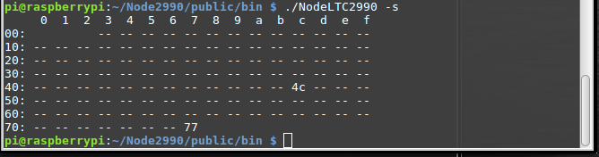

# LTC2990
Raspberry Pi3 I2C driver for Analog Devices LTC2990 IC 
  
This is a power monitor IC - you can measure voltage, shunt current and remote temperature using a transistor. The binary is also included if you do not wish to compile. The dependencies are g++ and WiringPi both of which are included in the Raspbian distribution. I will provide a development board with header pins for breadboard if anyone is interested, contact me here or at career4KW@gmail.com 
NOTE: Analog Devices has the Linduino platform and also provides drivers for many devices, check here:  
https://github.com/analogdevicesinc/Linduino  
and here is the Analog devices home page for the LTC2990: http://www.analog.com/en/products/monitor-control-protection/power-monitors/ltc2990.html#product-overview  
I plan to use my previous Raspberry PI Node web server to put the ltc2990 data on the web using the Pi as the node server.This will be included here when completed.  
<b> Updated 13MAY2018 </b> 
    * Streamlined code  
    * Implemented error codes and timeout for conversion  
   
<b>TODO</b> 
    * Node web server demo <i>See previous Node project: https://kwaite1021.github.io/piFrame/ </i>      
  
<b>Features</b> 
    * Very good accuracy 14 bit ADC internal - easy to use no complicated ADC setups  
    * Could also add separate remote temperature using a voltage output device such as the AD22100  
    * Excellent for measuring resistive current shunt voltages 
    * The console driver provided allows for logging of data to a csv file, with or without std output to screen 
    
<b>Raspberry Pi setup</b> 
    Quick: 
    (1) You need to have I2C enabled on the pi via raspi-config  
    (2) Ensure WiringPi library is installed [Should be installed and ready to go with Raspbian]  
    (3) Wire your LTC2990 to your Raspberry Pi using I2C bus 1  
    (4) For the web server, you need to have Node / npm setup     
     

<b>Driver usage standalone</b> 
    
  to compile: 'g++ ltc2990.cpp -lwiringPi -o console_ltc2990_v1'  
         to run: ./NodeLTC2990
         Running without any arguments runs once in the console. I have used the default setup where the shunt voltage across the resistor is V1-V2, and TR2 is the remote temperature sensor. 
   ./NodeLTC2990 -h <i>This shows help then exits</i> 
   Help for NodeLTC2990 v1.1 by Kevin Waite  
  Run without arguments for normal usage  
  Output format: voltage V2,current in amps,temperature TR2, errors  
 -s Show table of i2c devices on bus 1  
  Error codes:  
  Error = 0 no errors found  
  Error = 1 Temperature sensor open  
  Error = 2 Temperature sensor shorted  
  Error = 3 No response from device  
  
   
  Running with -s option  
    
   
    
<b>Reference links: </b> 
http://www.analog.com/en/products/monitor-control-protection/power-monitors/ltc2990.html 
http://wiringpi.com/ 
http://wiringpi.com/reference/i2c-library/ 
https://learn.sparkfun.com/tutorials/raspberry-pi-spi-and-i2c-tutorial 

NOTE: I used the Pi address 0x4C as this is where my LTC2990 is mapped to - you will see your address when 
      you run the i2cdetect program as above. I have set my LTC2990 to the default hardware address 00 on the LTC2900 pins 8       & 9. If your address does not appear as 0x4C when the i2cdetect program is run, then you will need to modify this             driver source. I am working to automatically update this address in the next release. The WiringPi library uses this         address to talk to the device.Please do use the reference links below if you have issues.

Thanks, 
Kevin Waite
